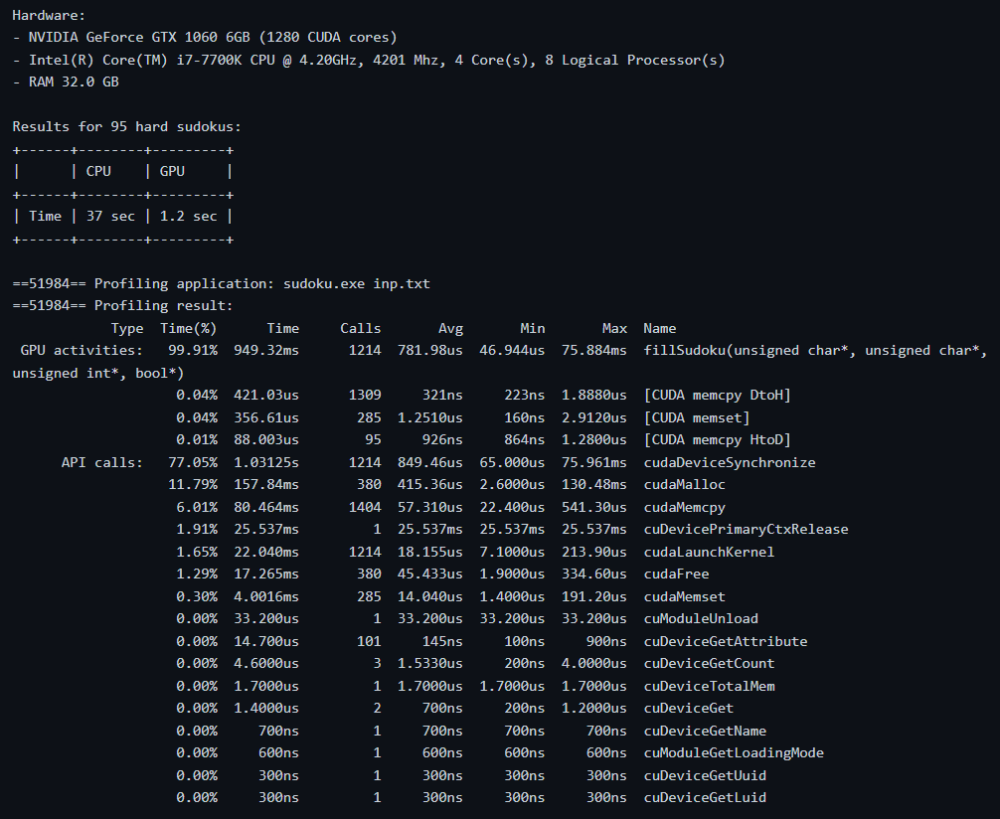

# Sudoku CUDA solver

## Goal

For each board there should be a set of new boards generated in parallel. Then each
one should be checked for consistency and then the process repeats. Be careful with
memory consumption and balance wisely between breadth and depth of the search but
also utilize parallel processing. Proper board encoding may significantly reduce memory
allocation.

Input: A selected sudoku board.

Output: A solved board or information that there are no solutions.

## Prerequisites
- [CUDA](https://developer.nvidia.com/cuda-toolkit) (recommended version >= 12)

## Usage

Build the program:
```
$ cd sudoku-cuda
$ make
```

Run the program:

```
$ ./sudoku [filepath]
```

- filepath: Input file should have 9x9 sudoku board in the following form:
```
400000805
030000000
000700000
020000060
000080400
000010000
000603070
500200000
104000000
``` 

## Benchmarks



## Notes

- Inspired by [evcu](https://github.com/evcu/cuda-sudoku-solver)